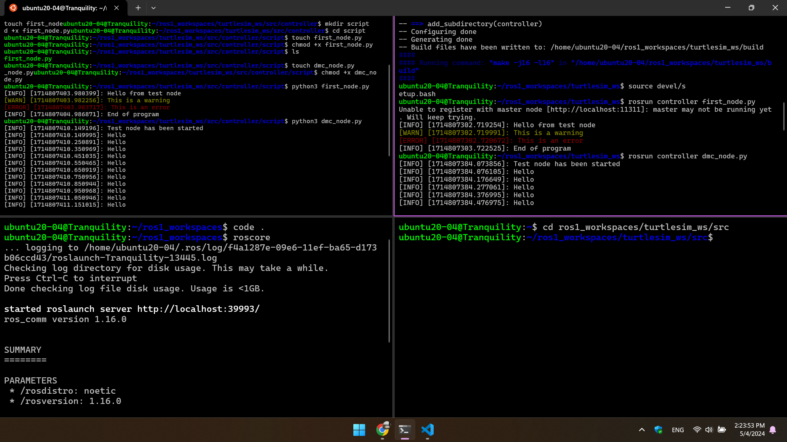
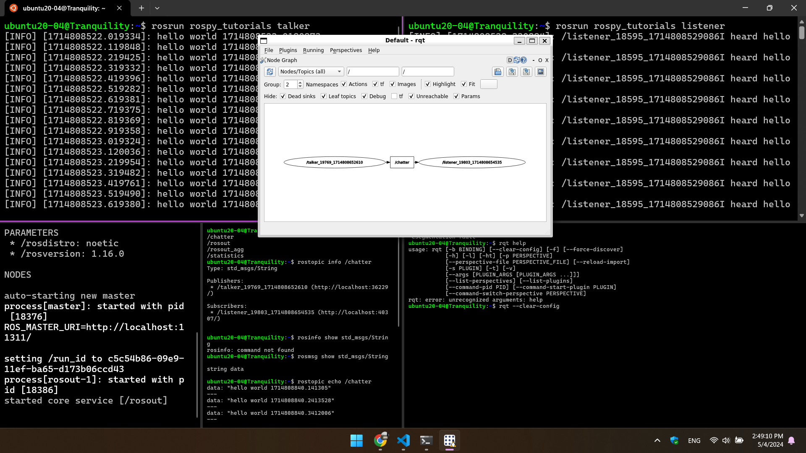
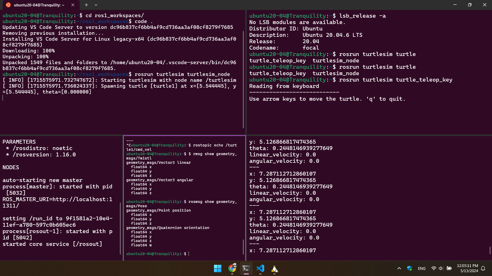

# Robotic Programming Class (Review and Demo)

The goal of this repository is to save everything that I learnt from Robotic Programming class (time). 

We are mostly using ROS, so it is very interesting. 

I am using WSL for Ubuntu 20-04 on Windows 11. Alright, to set it up go to cmd and check to see if you have wsl or not.
```
wsl
```
update to wsl2 (check bing for how to update to version2 and set all linux distro to version, I forget, but AI have all the command.)
```
wsl --update
```
check for all available distro 
```
wsl.exe --list --online
```
check the distro that you have
```
wsl --list
```

## Install ROS1 = Noetic from https://docs.ros.org/ 

### ROS Basic concept

-> ROS master (roscore) <-

<- Node -> Publishing -> Topic -> Callback -> Node -> subscribing ->


# Turtlesim_ws

create ws
```
mkdir -p turtlesim_ws/src
```


go to the dir, for my machine
```
cd ros1_workspaces/turtlesim_ws/src
```


## create pkg
```
catkin_create_pkg controller rospy roscpp turtlesim 
```
then catkin_make on ws


## create script node
```
cd controller 
mkdir script 
cd script
touch first_node.py
chmod +x first_node.py
```

Inside the first_node.py is the script that print out some messages
``` py
#!/usr/bin/env python3
import rospy

if __name__ == '__main__':
    rospy.init_node("test_node")
    rospy.loginfo("Hello from test node")
    rospy.logwarn("This is a warning")
    rospy.logerr("This is an error")
    rospy.sleep(1.0)
    rospy.loginfo("End of program")
```

create script to display message continously. in script dir
```
touch dmc_node.py
chmod +x dmc_node.py
```

inside dmc_node.py
``` py
#!/usr/bin/env python3
import rospy

if __name__ == '__main__':
    rospy.init_node("test_node")
    rospy.loginfo("Test node has been started")

    rate = rospy.Rate(10)

    while not rospy.is_shutdown():
        rospy.loginfo("Hello")
        rate.sleep()
```

running the script, don't forget to source and stay inside the ws
```
rosrun controller first_node.py
```

```
rosrun controller dmc_node.py
```
go to the script dir
```
python3 first_node.py
```

```
python3 dmc_node.py
```


### checking information 
rostopic list, rostopic info, rosmsg show, rostopic echo, rqt --clear-config


## Ros1 Publisher and Subscriber

### create Publisher
it is just a file (node in a pkg) in script but it publish some message to the topic
in script
```
touch draw_circle.py
chmod +x draw_circle.py
```

in the draw_circle.py, because when checking rostopic list, rostopic info /turtle1/cmd_vel, rosmsg show /geometry_msg/Twist, there are two information

```
geometry_msgs/Vector3 linear
  float64 x
  float64 y
  float64 z
geometry_msgs/Vector3 angular
  float64 x
  float64 y
  float64 z
```

so we will use it to create a publisher.

inside the draw_circle.py
``` py
#!/usr/bin/env python3
import rospy
from geometry_msgs.msg import Twist 

if __name__ == '__main__':
    rospy.init_node("draw_circle")
    rospy.loginfo("Node has been started.")

    pub = rospy.Publisher("/turtle1/cmd_vel", Twist, queue_size=10)

    rate = rospy.Rate(2)

    while not rospy.is_shutdown():
        msg = Twist()
        msg.linear.x = 2.0
        msg.angular.z = 1.0
        pub.publish(msg)
        rate.sleep()
```

After running without having this line in the package.xml, I see that it works just fine, so I don't know why do you need this. 
```
<build_depend>geometry_msg</build_depend>
```
to run this node, there are two way. 

go to script dir 
```
python3 draw_circle.py
```

or

cd to turtlesim_ws
```
source devel/setip.bash
```
rosrun
```
rosrun controller draw_circle.py
```


### Create Subscriber
The rostopic list, rostopic info (name), rosmsg show (info name), rostopic echo (topic name). It helps in showing what are the info that I need to create for pub and sub. 

So, to create a Subscriber that subscribe to the position of the turtlesim and show the position, you need to understand the message type. 

Use roscore and rosrun turtlesim turtlesim_node on separate terminal. Then check the geometry_msg/Twist

Create the publisher using the geometry_msg.msgs import Pose. Which means I have to check the geometry_msg/Pose msg. 



The topic shows that x and z are changing only because only linear and angular are the property of that turtlesim
```
cd ros1_workspaces/turtlesim_ws/src/controller/script
```
to create the script for showing the turtle position
```
touch pose_subscriber.py 
chmod +x pose_subscriber.py
```
inside the script
```py
#!/usr/bin/env python3

import rospy 
from turtlesim.msg import Pose 

def pose_callback(msg: Pose):
  rospy.loginfo("(" + str(msg.x) + ", " + str(msg.y) + ")")

if __name__ == "__main__": 
  rospy.init_node("turtlesim_pose_subscriber")

  sub = rospy.Subscriber("/turtle1/pose", Pose, callback=pose_callback)

  rospy.loginfo("Node has been started")

  rospy.spin()

```
cd back to turtlesim_ws and source devel/setup.bash

```
rosrun controller pose_subscriber.py
```

### Create Publisher and Subscriber at the same time
How to do it? 

```
cd ros1_workspaces/turtlesim_ws/src/controller/script
```

```
touch turtle_runningAround.py
chmod +x turtle_runningAround.py 
 
```
inside the turtle_runningAround.py
```py
#!/usr/bin/env python3

import rospy
from turtlesim.msg import Pose
from geometry_msgs.msg import Twist

def pose_callback(pose: Pose):
  cmd = Twist()
  if pose.x  > 9.0 or pose.x < 2.0 or pose.y > 9.0 or pose.y < 2.0:
    cmd.linear.x = 1.0
    cmd.angular.z = 1.4
  else:
    cmd.linear.x = 5.0
    cmd.angular.z = 0.0
  pub.publish(cmd)

if __name__ == "__main__":
  rospy.init_node("turtle_runningAround")

  pub = rospy.Publisher("/turtle1/cmd_vel", Twist, queue_size=10)
  sub = rospy.Subscriber("/turtle1/pose", Pose, callback=pose_callback)
  rospy.loginfo("Node has been started")

  rospy.spin()
```
cd to turtlesim_ws, source devel/setup.bash

```
rosrun controller turtle_runningAround.py
```
or go to src/controller/script
```
python3 turtlesim_runningAround.py
```

#### make turtlesim to move in starshape: 

```
touch starshape.py
chmod +x starshape.py
```
in starshape.py
```py
#!/usr/bin/env python3

import rospy 
from 

# I don't have time to think about it yet :'(
```
run in ws after source 
```
rosrun controller starshape.py
```
run in its dir
```
python3 starshape.py
```

# Turtlebot3_ws
What is this? The goal is to make the Turtlebot3 run in circle and draw a starshape. To have Tutlebot3, you need to do the instruction from these pages:

1. this [Get started choose Noetic](https://emanual.robotis.com/docs/en/platform/turtlebot3/quick-start/)

2. this [Simulation set up choose Neotic](https://emanual.robotis.com/docs/en/platform/turtlebot3/simulation/)

create the workspace 
```
mkdir -p turtlebot3_ws/src
```
go to turtlebot3_ws/src
```
git clone -b noetic-devel https://github.com/ROBOTIS-GIT/turtlebot3_simulations.git
```
cd to ws and catkin_make


to test the turtlebot3 by source devel/setup.bash and run this command in the ws
```
export TURTLEBOT3_MODEL=burger 
roslaunch turtlebot3_gazebo turtlebot3_empty_world.launch 
 
```

## Create pub and sub

Keep the test turtlebot3 running and check rostopic list, rostopic info (name), rosmsg show (name), rostopic echo (topic name). It is a way to find what kind of topic that can be used to create publisher and subscriber. 

go to src to create a package
```
catkin_create_pkg pubandsub rospy roscpp turtlebot3_gazebo geometry_msgs
```
we add geomety_mgs beacuse we know there is a topic that we need to publish into

### Create Pulisher

cd to pubandsub to create a script dir

in that turtlebot3_ws/src/pubandsub/script
```
touch runIncircle.py
chmod +x runIncircle.py
```

check information of the running nodes
```
rostopic list
rostopic info (topic name)
rosmsg show (topic types)
rostopic echo (topic name)
rqt --clear-config
```

in the runIncircle.py then catkin_make
```py
#!/usr/bin/env python3

import rospy
from geometry_msgs.msg import Twist

if __name__ == "__main__":
  rospy.init_node("run_in_circle")
  rospy.loginfo("Node have been started.")

  pub = rospy.Publisher("cmd_vel", Twist, queue_size=10)

  rate = rospy.Rate(2)

  while not rospy.is_shutdown():
    move_cmd = Twist()
    move_cmd.linear.x = 0.6
    move_cmd.angular.z = 0.9
    pub.publish(move_cmd)
    rate.sleep()
``` 
to run this script, stay in ws, source devel/setup.bash
```
export TURTLEBOT3_MODEL=burger 
rosrun pubandsub runIncircle.py
 
```
### Create Subscriber
The goal is to print out the position of the turtlebot3 

Go to /turtlebot3_ws/src/pubandsub/script
```
touch subscriber.py
chmod +x subscriber.py 
 
```
check the information 
```
rostopic list, 
rostopic info (topic name), 
rosmsg show (topic info/type), 
rostopic echo (topic name), 
rqt --clear-config 
  //to see plugin, inspection, Node graph
```

inside the subsriber.py I want to see the position of the turtlebot3
```py
#!/usr/bin/env python3

import rospy
from 
# no time 
```

```
rosrun pubandsub subscriber.py
```
or inside its dir
```
python3 subscriber.py
```

### Pub and Sub
The goal is to create a publisher and subscriber to control the robot to run in star shape. 

Go to /turtlebot3_ws/src/pubandsub/script
```
touch starpath.py
chmod +x starpath.py 
 
```
check the information 
```
rostopic list, 
rostopic info (topic name), 
rosmsg show (topic info/type), 
rostopic echo (topic name), 
rqt --clear-config 
  //to see plugin, inspection, Node graph
```

inside the starpath.py I want the robot to run in star path
```py
#!/usr/bin/env python3

import rospy
from 
# no time 
```

```
rosrun pubandsub starpath.py
```
or inside its dir
```
python3 starpath.py
```


# Smb_ws ([s](https://github.com/NelsenEW/eth-zurich-solution?tab=readme-ov-file))
The goal is to create launch files and practice the ros concept

The material is from [this site section 1](https://rsl.ethz.ch/education-students/lectures/ros.html). 


## Instructions from the exercise 

### 1. Setup the SMB simulation: 

" Download the smb_common zipped folder on the course website. Unzip it and place it in the ~/git folder. Navigate into ~/Workspaces/smb_ws/src and make a symlink. Compile the smb_gazebo package with catkin. "

go to your desired dir and create the ws
```
mkdir -p smb_ws/src
```

If you don't want to download and upzip, just clone this
``` 
git clone https://github.com/NelsenEW/eth-zurich-solution

``` 


Download the zip and place it inside the ws's src. After download and place it inside src of the ws then unzip the file with: 
```
unzip smb_common.zip
```


then download missing depencies
``` 
sudo apt install -y ros-noetic-hector-gazebo-plugins \
                    ros-noetic-velodyne \
                    ros-noetic-velodyne-description \
                    ros-noetic-velodyne-gazebo-plugins \
                    ros-noetic-pointcloud-to-laserscan \
                    ros-noetic-twist-mux
```


finally do catkin_make in the ws dir


to test the simulations, stay inside the ws and source. The same process with roscore on different terminal. 
```
roslaunch smb_gazebo smb_gazebo.launch
```

### 2. Launch the simulation
" with roslaunch and inspect the created nodes and their topics using (Lecture 1 Slides 11/12): 

```
rosnode list
rostopic list
rostopic echo [TOPIC]
rostopic hz [TOPIC]
rqt_graph: rqt --clear-config
```
"

There is a rosmsg show (topic msg) missing, because we don't need to see it since we are not programming anything

I am sure there are messages showing, but which one is useful? 


### 3. Command a desired velocity
to the robot from the terminal (rostopic pub [TOPIC]) (Lecture 1 Slide 13)


On a different terminal write 
```
rostopic pub /cmd_vel geometry_msgs/Twist '[0.5,0,0]' '[0,0,0]'

``` 


### 4. Use teleop_twist_keyboard to control your robot using the keyboard.

Find it online and compile it from source! Use git clone to clone the repository to the folder ~/git. (Lecture 1 Slides 22-26)


``` 
roslaunch smb_highlevel_controller smb_highlevel_controller.launch 
``` 


### 5. Write a launch file with the following content (Lecture 1 Slides 27-30):

- smb simulation with a different world: Include smb_gazebo.launch file and change the world_file argument to a world from the directory /usr/share/gazebo-11/worlds (e.g. worlds/robocup14_spl_field.world). This might take a little while to load the first time. Note that the world_name is with respect to /usr/share/gazebo-11/

The world file argument is hardcoded as follow: 

``` 
<arg name="world_file" value="/usr/share/gazebo-9/worlds/robocup14_spl_field.world"/>
``` 


# URDF_Gazebo_Sensors_Controller-Pub-Sub_ws


# MOVEIT 

