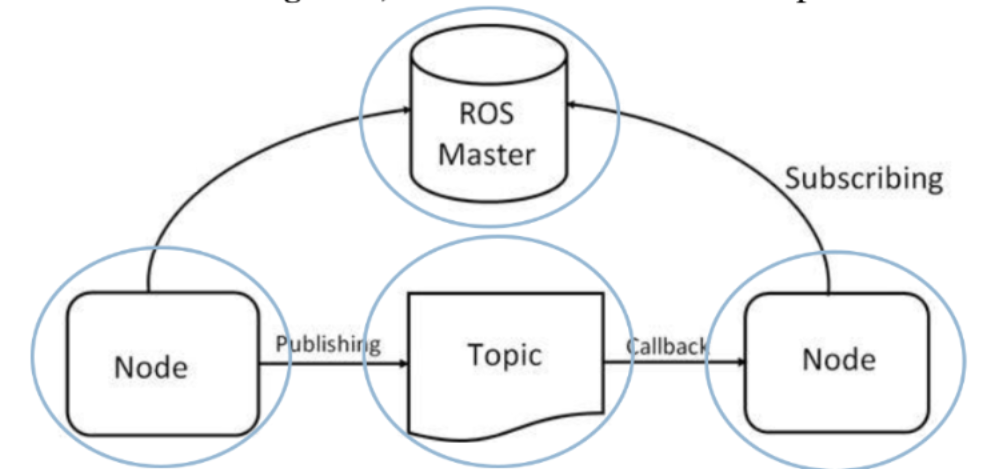

# Learning ROS1

I am using WSL for Ubuntu 20-04. 

## install ROS1 = Noetic from https://docs.ros.org/ 

This is for learning and Reviewing ROS1. I will put everything in here. Basically everything about what I have learnt!

### ROS Basic concept

-> ROS master <-

<- Node -> Publishing -> Topic -> Callback -> Node -> subscribing ->




# Turtlesim_ws
create ws
```
mkdir -p turtlesim_ws/src
```


go to the dir, for my machine
```
cd ros1_workspaces/turtlesim_ws/src
```


## create pkg
```
catkin_create_pkg controller rospy roscpp turtlesim 
```
then catkin_make on ws


## create script node
```
cd controller 
mkdir script 
cd script
touch first_node.py
chmod +x first_node.py
```

Inside the first_node.py is the script that print out some messages
``` py
#!/usr/bin/env python3
import rospy

if __name__ == '__main__':
    rospy.init_node("test_node")
    rospy.loginfo("Hello from test node")
    rospy.logwarn("This is a warning")
    rospy.logerr("This is an error")
    rospy.sleep(1.0)
    rospy.loginfo("End of program")
```

create script to display message continously. in script dir
```
touch dmc_node.py
chmod +x dmc_node.py
```

inside dmc_node.py
``` py
#!/usr/bin/env python3
import rospy

if __name__ == '__main__':
    rospy.init_node("test_node")
    rospy.loginfo("Test node has been started")

    rate = rospy.Rate(10)

    while not rospy.is_shutdown():
        rospy.loginfo("Hello")
        rate.sleep()
```

running the script, don't forget to source and stay inside the ws
```
rosrun controller first_node.py
```

```
rosrun controller dmc_node.py
```
go to the script dir
```
python3 first_node.py
```

```
python3 dmc_node.py
```


### checking information 
rostopic list, rostopic info, rosmsg show, rostopic echo, rqt --clear-config


## Ros1 Publisher and Subscriber

### create Publisher
it is just a file (node in a pkg) in script but it publish some message to the topic
in script
```
touch draw_circle.py
chmod +x draw_circle.py
```

in the draw_circle.py, because when checking rostopic list, rostopic info /turtle1/cmd_vel, rosmsg show /geometry_msg/Twist, there are two information

```
geometry_msgs/Vector3 linear
  float64 x
  float64 y
  float64 z
geometry_msgs/Vector3 angular
  float64 x
  float64 y
  float64 z
```

so we will use it to create a publisher.

inside the draw_circle.py
``` py
#!/usr/bin/env python3
import rospy
from geometry_msgs.msg import Twist 

if __name__ == '__main__':
    rospy.init_node("draw_circle")
    rospy.loginfo("Node has been started.")

    pub = rospy.Publisher("/turtle1/cmd_vel", Twist, queue_size=10)

    rate = rospy.Rate(2)

    while not rospy.is_shutdown():
        msg = Twist()
        msg.linear.x = 2.0
        msg.angular.z = 1.0
        pub.publish(msg)
        rate.sleep()
```

After running without having this line in the package.xml, I see that it works just fine, so I don't know why do you need this. 
```
<build_depend>geometry_msg</build_depend>
```
to run this node, there are two way. 

go to script dir 
```
python3 draw_circle.py
```

or

cd to turtlesim_ws
```
source devel/setip.bash
```
rosrun
```
rosrun controller draw_circle.py
```


### Create Subscriber
The rostopic list, rostopic info (name), rosmsg show (info name), rostopic echo (topic name). It helps in showing what are the info that I need to create for pub and sub. 

So, to create a Subscriber that subscribe to the position of the turtlesim and show the position, you need to understand the message type. 

Use roscore and rosrun turtlesim turtlesim_node on separate terminal. Then check the geometry_msg/Twist

Create the publisher using the geometry_msg.msgs import Pose. Which means I have to check the geometry_msg/Pose msg. 


The topic shows that x and z are changing only because only linear and angular are the property of that turtlesim
```
cd /ros1_workspaces/turtlesim_ws/src/controller/script
```
to create the script for showing the turtle position
```
touch pose_subscriber.py 
chmod +x pose_subscriber.py
```
inside the script
```py
#!/user/bin/env python3

import rospy 
from turtlesim.msg import Pose 

def pose_callback(msg: Pose):
  rospy.loginfo("(" + str(msg.x) + ", " + str(msg.y) + ")")

if __name__ = "__main__": 
  rospy.init_node("turtlesim_pose_subscriber")

  sub = rospy.Subscriber("/turtle1/pose", Pose, callback=pose_callback)

  rospy.loginfo("Node has been started")

  rospy.spin()

```
cd back to turtlesim_ws and source devel/setup.bash

```
rosrun controller pose_subscriber.py
```

### Create Publisher and Subscriber at the same time
How to do it? 

```
cd /ros1_workspaces/turtlesim_ws/src/controller/script

```

```
touch turtle_runningAround.py
chmod +x turtle_runningAround.py
```
inside the turtle_runningAround.py
```py
#!/usr/bin/env python3

import rospy
from turtlesim.msg import Pose
from geometry_msg.msg import Twist

def pose_callback(pose: Pose):
  cmd = Twist()
  if pose.x  > 9.0 or pose.x < 2.0 or pose.y > 9.0 or pose.z < 2.0:
    cmd.linear.x = 1.0
    cmd.angular.z = 1.4
  else 
    cmd.linear.x = 5.0
    cmd.angular.z = 0.0
  pub.publish(cmd)

if __name__ = "__main__":
  rospy.init_node("turtle_runningAround")

  pub = rospy.Publisher("/turtle1/cmd_vel", Twist, queue_size=10)
  sub = rospy.Subscriber("/turtle1/pose", Pose, callback=pose_callback)
  rospy.loginfo("Node has been started")

  rospy.spin()
```
cd to turtlesim_ws, source devel/setup.bash

```
rosrun controller turtle_runningAround.py
```


# Turtlebot3_ws


# Smb_ws

```

```

```

```

```

```